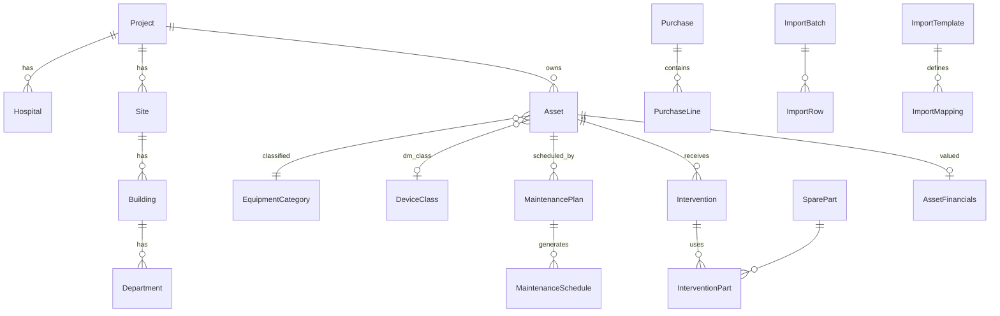

# GMAO biomédicale K'BIO — Architecture cible (depuis template Excel métier)

Document de cadrage : traduire la **logique** des classeurs Excel GMAO (feuilles, relations, indicateurs) en application web **multi-projets / multi-clients**, sans recopier l’Excel écran par écran.

**Stack réelle du dépôt** (à conserver) : Next.js (App Router), TypeScript, Tailwind, Prisma, PostgreSQL, NextAuth, Zod.  
La spec initiale mentionnait Supabase + RLS : l’équivalent est **filtrage tenant/projet dans Prisma** + **RBAC** (rôles existants) + **vérifications dans les Server Actions / route handlers** — pas de migration obligatoire vers Supabase.

---

## 1. Lecture métier d’un template Excel GMAO « type »

Les classeurs métier découpent en général le travail en **domaines faiblement couplés** reliés par des clés métier :

| Feuille Excel (concept) | Rôle métier | Objectif applicatif |
|-------------------------|-------------|---------------------|
| Guide utilisateur | Onboarding, définitions | **Module J** — Centre d’aide, dictionnaire de champs, doc statuts |
| Tableau de bord | Synthèse, KPIs | **Module I** — Dashboard GMAO (agrégations, filtres, graphiques) |
| Inventaire GMAO | Cœur du référentiel équipements | **Module B** — Inventaire + fiche équipement + historique |
| Plan MP | Préventif, échéances | **Module D** — Plans, génération d’échéances, checklists |
| Immobilisation | Valeur, amortissement | **Module H** — Données financières & règles d’amortissement |
| Stock pièces | Consommables, kits, seuils | **Module F** — Catalogue, stocks par site, mouvements |

**Philosophie** : l’Excel est un **modèle mental** et un **contrat d’import** ; l’app est la **source de vérité** structurée (relations, contraintes, droits, traçabilité).

---

## 2. Modules applicatifs cibles (A → J)

- **A — Référentiel projet / organisation**  
  Clients (déjà `Client`), projets (`Project`), pays, établissements, sites, bâtiments, services, techniciens (`User` + rôles), fournisseurs, fabricants, catégories d’équipements (`EquipmentCategory` + extensions).

- **B — Inventaire GMAO**  
  Extension du modèle `Asset` actuel vers **fiche équipement biomédicale** (classe DM, obligation MP, fréquence, immobilisation liée, documents, historique statut).

- **C — Import intelligent Excel**  
  Upload, choix de feuille, mapping colonnes → champs, validation Zod, aperçu, doublons, stratégie create/update/merge, rapport + journal d’erreurs, **templates réutilisables** (`import_templates`, `import_mappings`, …).

- **D — Plan maintenance préventive**  
  S’appuie sur `MaintenancePlan` existant : fréquences normalisées, génération d’échéances, statuts (prévue, en retard, …), checklists, vues calendrier / technicien / site.

- **E — Interventions**  
  S’appuie sur `Intervention` + `WorkOrder` : types (préventif / curatif / …), pièces, coûts, pièces jointes, workflow statuts.

- **F — Stock pièces / kits**  
  Nouvelles entités : catalogue pièces, compatibilités, emplacements, niveaux de stock, mouvements, kits MP.

- **G — Achats**  
  Commandes, lignes, rattachement projet / site / fournisseur, lien équipement ou pièces.

- **H — Immobilisation**  
  `asset_financials`, règles d’amortissement par catégorie, écritures / snapshots pour reporting.

- **I — Dashboard GMAO**  
  Requêtes agrégées + cache optionnel (`dashboard_snapshots` ou matérialized views plus tard), filtres multi-dimensions.

- **J — Aide**  
  Pages statiques / MDX ou CMS léger : guide import, dictionnaire champs, rôles.

---

## 3. Schéma de données (cible) — entités et relations

### 3.1 Déjà présent dans Prisma (à faire évoluer)

- `Project`, `Client`, `User`, `Asset`, `MaintenancePlan`, `Intervention`, `WorkOrder`, `Alert`, `ProjectDocument`, `EquipmentCategory`, etc.

### 3.2 Extensions / nouvelles tables (phases ultérieures)

**Référentiel organisation (scopé par `projectId` sauf réf. globaux)**  
- `Hospital` / `Establishment` — lien `projectId`, métadonnées légales optionnelles  
- `Site` — site physique (peut mapper `Asset.site` + clé étrangère)  
- `Building`, `Department` — hiérarchie site → bâtiment → service  
- `Supplier`, `Manufacturer` — réf. fournisseurs / fabricants  
- `DeviceClass` — classes DM (référentiel réglementaire)  
- `MaintenanceFrequency` — enum ou table (mensuel, trimestriel, custom jours)

**Inventaire enrichi**  
- Étendre `Asset` (ou table `BiomedEquipmentExtension` 1–1) pour : `gmaoNumber`, `deviceClassId`, `preventiveObligation`, `maintenanceFrequencyId`, `inventoryClientCode`, `fundingSource`, `purchaseValue`, `warrantyEnd`, etc.  
- `EquipmentStatusHistory` — historique statut / état fonctionnel  
- `EquipmentDocument` — si distinction fine par rapport à `ProjectDocument`

**MP**  
- `MaintenanceSchedule` / occurrences générées à partir de `MaintenancePlan`  
- `MaintenanceChecklist`, `MaintenanceChecklistItem`, résultats par occurrence

**Interventions**  
- `InterventionPart` — consommation pièces  
- `InterventionAttachment` — photos avant/après

**Stock**  
- `SparePart`, `MaintenanceKit`, `MaintenanceKitItem`  
- `StockLocation` (par site / magasin)  
- `StockLevel`, `StockMovement`  
- `SparePartCompatibility` (pièce ↔ modèle / marque / équipement)

**Achats**  
- `Purchase`, `PurchaseLine`  
- `EquipmentAcquisition` — lien achat → création / mise à jour `Asset`

**Immobilisation**  
- `AssetFinancials` (1–1 `Asset`)  
- `DepreciationRule` (par catégorie)  
- `DepreciationEntry` (période, montants)

**Import**  
- `ImportTemplate`, `ImportMapping` (JSON : colonne Excel → champ)  
- `ImportBatch`, `ImportRow`, `ImportError`  
- Statut batch : `DRAFT`, `VALIDATING`, `APPLIED`, `FAILED`

### 3.3 Diagramme simplifié (Mermaid)

---

## 4. Architecture de l’import Excel

### 4.1 Pipeline

1. **Upload** → stockage temporaire sécurisé (disque ou S3-compatible), référence `ImportBatch`.  
2. **Parse** — `xlsx` / SheetJS côté serveur : liste des feuilles, première ligne = en-têtes.  
3. **Profil** — choix d’un `ImportTemplate` (ex. « Inventaire standard K’BIO ») ou import ad hoc.  
4. **Mapping** — UI : colonne A → champ `Asset.serialNumber`, etc. ; persistance dans `ImportMapping`.  
5. **Validation** — ligne par ligne avec Zod + règles métier (dates, enums, références obligatoires).  
6. **Aperçu** — N premières lignes + compteurs erreurs / warnings.  
7. **Déduplication** — clés : `gmaoNumber` OU (`manufacturer` + `model` + `serialNumber`) paramétrable par template.  
8. **Stratégie** — `CREATE_ONLY` | `UPDATE_ONLY` | `UPSERT` | `MERGE` (champs non vides seulement).  
9. **Application** — transaction Prisma par lot (chunks) ; `ImportRow` statut + `ImportError` détail.  
10. **Rapport** — JSON + téléchargement CSV des lignes en échec.

### 4.2 Principes

- Jamais d’import « magique » sans aperçu ni traçabilité.  
- **Simulation** : flag `dryRun` qui valide sans écrire.  
- **Rejeu** : conserver fichier source + mapping pour ré-exécution contrôlée.

---

## 5. Architecture technique (dans ce monorepo)

- **Routes** : `/portal/projects/[projectId]/gmao/*` — sous-arbre dédié (sidebar interne GMAO).  
- **Données** : Prisma ; politique **projectId obligatoire** sur toutes les requêtes GMAO.  
- **Auth** : NextAuth + `canReadProject` / `canWriteData` (client = lecture seule déjà géré au portail).  
- **UI** : tables denses + filtres ; TanStack Table si besoin ; graphiques Recharts pour dashboard.  
- **Forms** : React Hook Form + Zod (déjà dans les deps).

**Supabase / RLS** : option future ; pas requis pour une V1 si les garde-fous serveur sont stricts.

---

## 6. Feuille de route de livraison (alignée sur ta spec)

| Étape | Contenu |
|-------|---------|
| **1** | Ce document + hub `/gmao` par projet (navigation) |
| **2** | Schéma Prisma itératif : réf. organisation (Site, Department, …) + enrichissement `Asset` |
| **3** | UI inventaire avancé + fiche équipement + historique statut |
| **4** | Moteur import (template + mapping + batch + rapport) |
| **5** | MP : échéances générées + checklists + vues |
| **6** | Stock / kits / mouvements |
| **7** | Achats + lien immobilisation |
| **8** | Dashboard agrégé + exports |
| **9** | Centre d’aide + durcissement permissions + seeds réalistes |

---

## 7. Ce qu’on ne fait pas

- Une seule table « fourre-tout ».  
- Import sans validation ni journal.  
- Reproduction pixel-perfect de l’Excel.  
- Mélanger logs, indicateurs calculés et données métier sans tables dédiées.

---

## 8. Prochaine action concrète dans le code

1. Déposer le **fichier Excel template** (même anonymisé) dans un partage sécurisé pour caler les **noms de feuilles et colonnes** sur le mapping par défaut.  
2. Implémenter **migration Prisma** : première brique référentiel (ex. `Site`, `Department` liés `projectId`) + champs manquants sur `Asset` les plus critiques pour l’inventaire biomédical.  
3. Brancher l’**import** sur une première feuille (« Inventaire GMAO ») avec mapping minimal.
